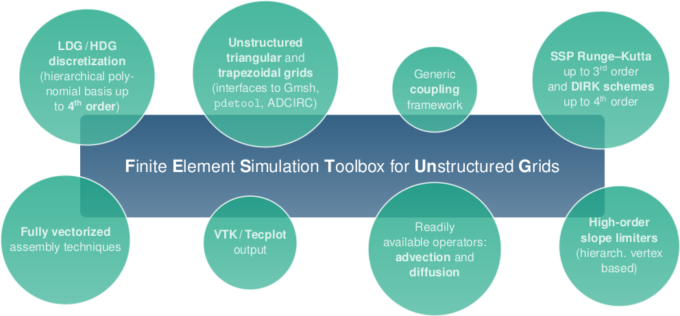

# FESTUNG

**FESTUNG** (Finite Element Simulation Toolbox for Unstructured Grids) is a Matlab / GNU Octave toolbox for the discontinuous Galerkin (DG) method on unstructured grids. It is primarily intended as a fast and flexible prototyping platform and testbed for students and developers. 

FESTUNG relies on fully vectorized matrix/vector operations to deliver optimized computational performance combined with a compact, user-friendly interface and a comprehensive documentation.

Have a look at our [gallery](doxygen/gallery.md) for example applications that use FESTUNG.



## Get it
* The latest published version can always be downloaded from the [GitHub repository](https://github.com/FESTUNG/FESTUNG).
To check out the latest version, run 
```bash
git clone https://github.com/FESTUNG/FESTUNG.git
```

* Tarballs of previous code versions and further information about the project can be found on our [Project page](https://math.fau.de/FESTUNG).

## Use it
Model problems are defined following a generic [solver structure](doxygen/solverStructure.md).
Have a look at the implementation of the standard (element-based) DG discretizations of linear advection (folders `advection` for time-explicit and `advection_implicit` for time-implicit) or the LDG discretization of the diffusion operator (folder `diffusion`).
A hybridized DG discretization of linear advection can be found in the folder `hdg_advection`.

Start the computation for any of these problems using `main(<folder name>)`, for example

```Matlab
main('advection')
```

To change simulation parameters or modify initial and boundary data, have a look into `configureProblem.m` in the respective problem folder, or pass them directly when calling the problem solver, e.g.,

```Matlab
main('advection', 'tEnd', 10, 'p', 1, 'hmax', 2^-4)
```

to run the Advection problem with a different end time and linear ansatz functions on a mesh with maximum element size of 1/16.

Output files are written in [VTK format](http://www.vtk.org/VTK/img/file-formats.pdf) or [TecPlot ASCII file format](http://paulbourke.net/dataformats/tp/) and can be visualized, e.g., using [Paraview](http://www.paraview.org/).

## Development
When developing code for or with FESTUNG we suggest to stick to the [Naming convention](namingConvention.md) to allow for better readability and a similar appearance of all code parts. 
Keep in mind the generic [solver structure](doxygen/solverStructure.md) when modifying and adding new problems.
All files should be documented using the [Doxygen syntax](http://www.stack.nl/~dimitri/doxygen/manual/).

For more details, see [Using and contributing to FESTUNG](doxygen/usingContributing.md).

## Documentation
All routines are carefully documented in the Doxygen format, which allows to produce [this documentation](https://www1.am.uni-erlangen.de/FESTUNG). It can be generated by calling `doxygen` in the main directory.

## Contributors
The main developers of FESTUNG are [Florian Frank](http://frank.ink), [Balthasar Reuter](https://www.ecmwf.int/en/about/who-we-are/staff-profiles/balthasar-reuter), and [Vadym Aizinger](https://www.wr.uni-bayreuth.de/en/team/vadym-aizinger/). Its initial release was developed at the [Chair for Applied Mathematics I](https://www.math.fau.de/angewandte-mathematik-1/) at [Friedrich-Alexander University Erlangen-Nürnberg](https://www.fau.eu).

Since then, significant contributions were made by [Hennes Hajduk](http://www.mathematik.uni-dortmund.de/de/personen/person/Hennes+Hajduk.html) and [Andreas Rupp](https://andreas-rupp.eu/)

### Third party libraries
* FESTUNG makes extensive use of the built-in routines in MATLAB / GNU Octave.
* [triquad](https://github.com/FESTUNG/FESTUNG/blob/master/triquad.m) was written by Greg von Winckel. See [triquad.txt](https://github.com/FESTUNG/FESTUNG/blob/master/triquad.txt) for license details.
* [m2cpp.pl](https://github.com/FESTUNG/FESTUNG/blob/master/thirdParty/doxygenMatlab/m2cpp.pl) by Fabrice to generate a [Doxygen](http://www.stack.nl/~dimitri/doxygen/) documentation. See [license.txt](https://github.com/FESTUNG/FESTUNG/blob/master/thirdParty/doxygenMatlab/license.txt) for license details.

## License 
FESTUNG is published under GPLv3, see [License](license.md) file.

## Version 
* Version 1.0 with an accompanying overview paper in preparation.
* Version 0.4 as published in the preprint *Reuter, Rupp, Aizinger, Frank, Knabner:* "FESTUNG: A MATLAB / GNU Octave toolbox for the discontinuous Galerkin method. Part IV: Generic problem framework and model-coupling interface". *In: Communications in Computational Physics 28 (2020) 827-876, Available online June 2020, ISSN 1991-7120, https://doi.org/10.4208/cicp.OA-2019-0132 .*
* Version 0.3 as published in the paper *Jaust, Reuter, Aizinger, Schuetz, Knabner:* "FESTUNG: A MATLAB / GNU Octave toolbox for the discontinuous Galerkin method. Part III: Hybridized discontinuous Galerkin (HDG) formulation". *In: Computers & Mathematics with Applications 75.12 (2018) 4505-4533, Available online 2 May 2018, ISSN 0898-1221, https://doi.org/10.1016/j.camwa.2018.03.045 .*
* Version 0.2 as published in the paper *Reuter, Aizinger, Wieland, Frank, Knabner:* "FESTUNG: A MATLAB / GNU Octave toolbox for the discontinuous Galerkin method. Part II: Advection operator and slope limiting". *In: Computers & Mathematics with Applications 72 (2016) 1896-1925, Available online 25 August 2016, ISSN 0898-1221, https://doi.org/10.1016/j.camwa.2016.08.006 .*
* Version 0.1 as published in the paper *Frank, Reuter, Aizinger, Knabner:* "FESTUNG: A MATLAB / GNU Octave toolbox for the discontinuous Galerkin method. Part I: Diffusion operator". *In: Computers & Mathematics with Applications 70 (2015) 11-46, Available online 15 May 2015, ISSN 0898-1221, https://doi.org/10.1016/j.camwa.2015.04.013 .*


## Contact
Homepage: [https://math.fau.de/FESTUNG](https://math.fau.de/FESTUNG)
